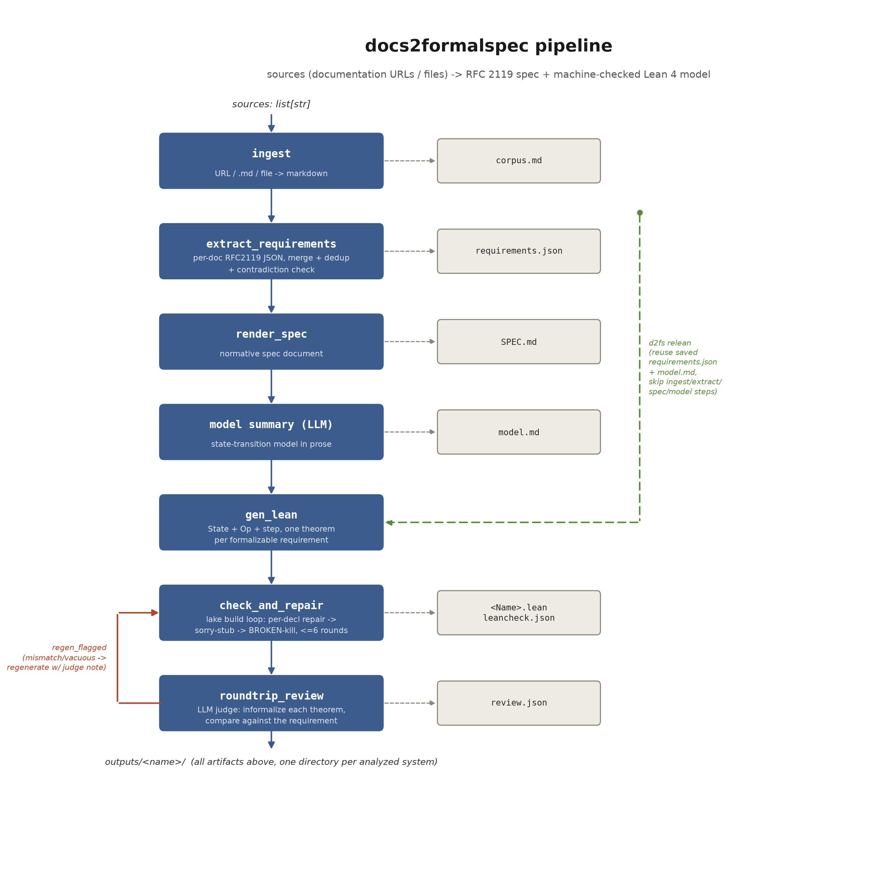

# docs2formalspec

[](LICENSE)
[](pyproject.toml)
[](lean/lean-toolchain)

Turn a protocol's own documentation into **a normative RFC 2119 specification** and **a machine-checked
Lean 4 formal model** — automatically, then optionally hardened by hand. Runs on local-class LLMs via
Ollama Cloud (OpenAI-compatible). Destined to become a harness plugin callable from the
[SPECA](https://github.com/NyxFoundation/speca) repository.

```
docs URLs / files  ─────────────────────────────────────►  SPEC.md + <Name>.lean + review.json
                     (RFC 2119 spec)   (Lean 4 model, proved)   (faithfulness verdicts)
```



*(diagram source: [`docs/generate_architecture.py`](docs/generate_architecture.py) — regenerate with
`uv run --with matplotlib python docs/generate_architecture.py` after editing the pipeline)*

---

## Why

Turning prose documentation into a state machine you can prove things about is normally a manual,
expert-hours exercise. This tool automates the first pass end-to-end — extraction, specification, Lean
model, proof-repair loop, and a round-trip faithfulness check — and reports honest metrics at every stage
(sorry/vacuous/killed counts are never hidden). See [`docs/01-related-work.md`](docs/01-related-work.md)
for the survey of adjacent work this design draws on, and
[`docs/00-implementation-policy.md`](docs/00-implementation-policy.md) for the design rationale.

## Case study: Apyx

Run end-to-end against [Apyx](https://docs.apyx.fi) (a dividend-backed stablecoin protocol), then taken
further by hand. Full verification report, results, and methodology:
[`outputs/apyx/README.md`](outputs/apyx/README.md) (complete run history in
[`docs/03-eval-log.md`](docs/03-eval-log.md)).

## Installation

Requires Python ≥3.11, [uv](https://docs.astral.sh/uv/), and a Lean 4 toolchain (for the compile-check
step):

```bash
# Python deps
uv sync

# Lean toolchain (elan manages this; lean/lean-toolchain pins the exact version, currently 4.31.0)
curl https://raw.githubusercontent.com/leanprover/elan/master/elan-init.sh -sSf | sh
```

The Lean project (`lean/`) is **mathlib-free** — zero external Lean dependencies — so the very first
`lake build` fetches only the toolchain itself, and every subsequent compile-check is sub-second.

### API key

An `OLLAMA_API_KEY` for [Ollama Cloud](https://ollama.com) is required, from either the environment or
`~/.hermes/.env` (`OLLAMA_API_KEY=...`).

## Usage

```bash
uv run d2fs run --name apyx https://docs.apyx.fi/apyx-overview/how-apyx-works.md [more URLs/files...]
```

| Command | Effect |
|---|---|
| `d2fs run --name <n> <sources...>` | Full pipeline: ingest → extract → spec → model → Lean → review |
| `d2fs relean --name <n>` | Re-run only the Lean generation/repair/review stages, reusing the saved `requirements.json` + `model.md` from a prior `run` — cheap iteration when only the Lean-generation step needs another attempt |
| `d2fs version` | Print the tool version |

Outputs land in `outputs/<name>/` (one directory per analyzed system — see
[Output layout](#output-layout) below):

| File | Content |
|---|---|
| `corpus.md` | Ingested source documents, concatenated |
| `requirements.json` | Extracted RFC 2119 requirements: `id`, `category`, `statement`, `rationale`, `source_quote`, `formalizable` flag |
| `SPEC.md` | The rendered RFC 2119 specification document |
| `model.md` | Plain-English state-transition model summary |
| `<Name>.lean` | Lean 4 model (`State`, `Op`, `step`) + one `theorem req_*` per formalizable requirement |
| `leancheck.json` | Compile status: `ok`, `theorems`, `sorries`, `vacuous`, `killed`, `proved` |
| `review.json` | Per-requirement faithfulness verdict (`full`/`partial`/`mismatch`/`vacuous`/`missing`/`unformalizable`) from an independent LLM judge |

`outputs/apyx/` also has a [`README.md`](outputs/apyx/README.md) of its own — a full verification report
written for that case study's non-Lean audience (what was proved, what wasn't, and why), worth reading as
a template for what a completed run's write-up looks like.

## Pipeline

1. **`ingest`** — fetch each source (URL → `trafilatura` → markdown, or read a local `.md`/text file directly).
2. **`extract_requirements`** — per-document LLM extraction of RFC 2119 requirements into typed JSON, then
   merge/dedupe across documents with a contradiction check.
3. **`render_spec`** — write the merged requirements out as a normative `SPEC.md`.
4. **model summary** — one LLM call distilling `SPEC.md` into a concrete state/actor/operation summary
   (`model.md`), which anchors the Lean generation prompt.
5. **`gen_lean`** — generate the Lean domain model (`structure State`, an `inductive Op` of every protocol
   action, `step : State → Op → Address → Option State`) and one theorem per formalizable requirement,
   batched with an immediate per-batch compile gate so hallucinated identifiers get caught and retried
   before they reach the full file.
6. **`check_and_repair`** — the `lake build` feedback loop. Failures are attributed **per declaration**
   (never whole-file), and each failing theorem escalates deterministically: 1st failure → targeted LLM
   repair of just that theorem; 2nd → proof stubbed with `sorry` (statement kept, so it still counts as a
   formalized requirement); 3rd → the declaration is commented out with a `-- BROKEN:` marker (never
   silently deleted — kept for provenance). A cheap deterministic tactic menu (`simp`, `omega`, `decide`,
   ...) is tried on every `sorry` before giving up, at no LLM cost.
7. **`roundtrip_review`** — a second, independent LLM reads each theorem's *actual formal statement* (never
   its docstring) and restates it in plain English, then a judge compares that reading against the
   original requirement text. This is the Clover-style consistency gate that catches "compiles but says
   the wrong thing."
8. **`regen_flagged`** — theorems the judge flagged `mismatch`/`vacuous` get one targeted regeneration
   attempt using the judge's note as feedback, then loop back through step 6-7.

`d2fs relean` re-enters at step 5, reusing the `requirements.json`/`model.md` a prior `run` already
produced — useful for iterating on Lean-generation quality alone.

### Beyond the automated pipeline: hand-verification

The automated pipeline (steps above, driven by mid-size open models via Ollama Cloud) is designed to
plateau honestly rather than oversell itself — see [`docs/03-eval-log.md`](docs/03-eval-log.md) for 15
runs' worth of failure modes and fixes, converging around 53% faithful coverage with roughly a 4/55 proof
rate. Nothing in the design prevents *also* taking a pipeline's output further by hand (or with a
higher-grade model doing the same hand-editing job): reading the generated `<Name>.lean` and its
`review.json` mismatch notes, editing the Lean file directly, and re-running just `roundtrip_review` to
check faithfulness — no different in kind from what `check_and_repair`/`regen_flagged` already automate,
just with more judgment per fix. The `outputs/apyx/` case study did exactly this over 6 rounds (proof rate
→ 100%, faithful coverage → ~95%, plus finding and fixing two real access-control gaps in the model along
the way) — written up in full in [`outputs/apyx/README.md`](outputs/apyx/README.md) and
[`docs/03-eval-log.md`](docs/03-eval-log.md).

## Configuration

All via environment variable (or `~/.hermes/.env` for the API key):

| Variable | Default | Purpose |
|---|---|---|
| `OLLAMA_API_KEY` | *(required)* | Ollama Cloud API key |
| `D2FS_EXTRACT_MODEL` | `gpt-oss:120b` | Requirement extraction + spec writing |
| `D2FS_LEAN_MODEL` | `qwen3-coder:480b` | Lean generation/repair (code-specialized) |
| `D2FS_MODELGEN_MODEL` | `D2FS_LEAN_MODEL` | Domain-model generation (single call; quality over latency, can afford a slower/stronger model here) |
| `D2FS_REPAIR_MODEL` | `qwen3-coder:480b` | Per-declaration compile-error repair |
| `D2FS_REVIEW_MODEL` | `gpt-oss:120b` | Round-trip faithfulness judge |

## Output layout

Everything for one analyzed system lives under a single `outputs/<name>/` directory — no artifacts scattered
elsewhere. Re-running against the same name overwrites it; if you want to keep a prior run for comparison,
archive it under `outputs/<name>/archive/run<N>/` first (see `docs/00-implementation-policy.md` for the
convention, applied consistently across `outputs/apyx/archive/`).

## Development

```bash
uv sync --dev
uv run pytest              # unit tests for the Lean-file decl-splitting/rebuild logic (tests/)
```

The Lean project lives in `lean/` (mathlib-free, Lean 4.31 via `elan`) and is shared across every analyzed
system — `lake build` after any `run`/`relean` compiles whatever's currently in `lean/D2fsSpecs/`.
`lean/D2fsSpecs/<Name>.lean` is conventionally a symlink into `outputs/<name>/<Name>.lean` (see how
`outputs/apyx/Apyx.lean` is wired up) so there is exactly one copy of each generated model, editable from
either path, with `lake build` and the pipeline's own file-writing both resolving through the symlink
transparently.

## License

MIT — see [`LICENSE`](LICENSE).

---

Design notes, the related-work survey, the full 15-run automated-pipeline eval log, and the SPECA harness
plugin design all live in [`docs/`](docs/).
