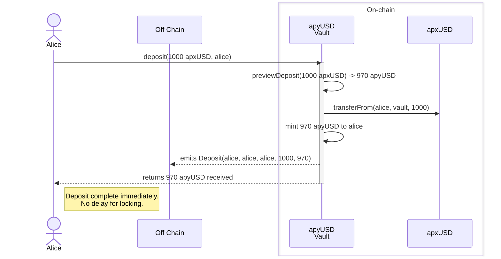
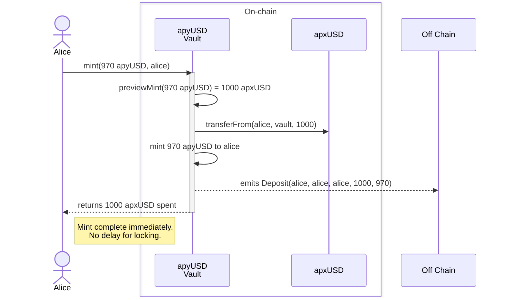
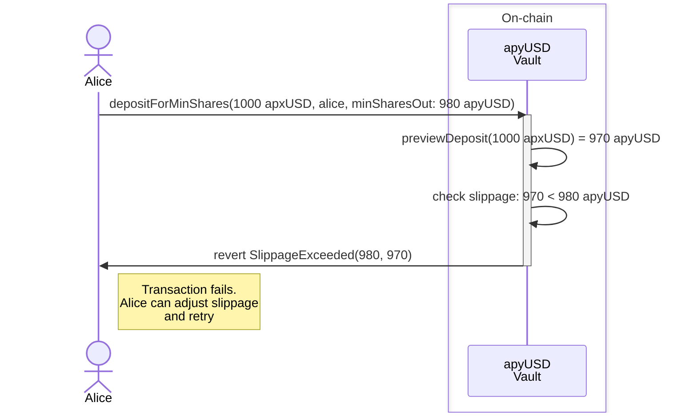
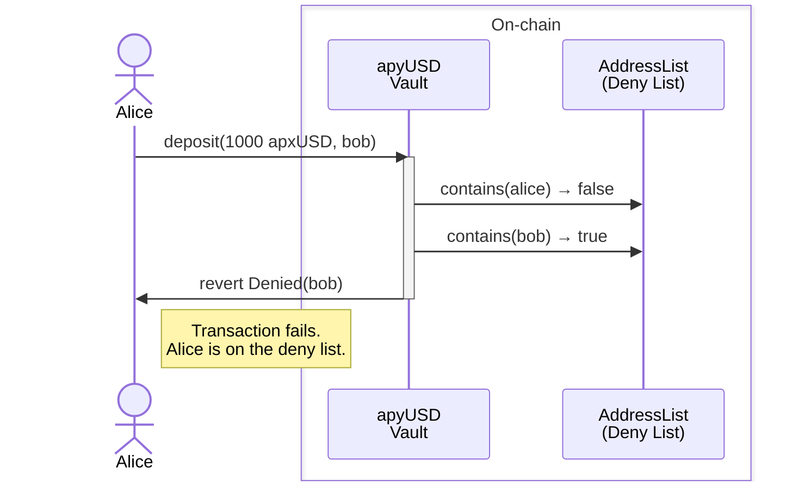
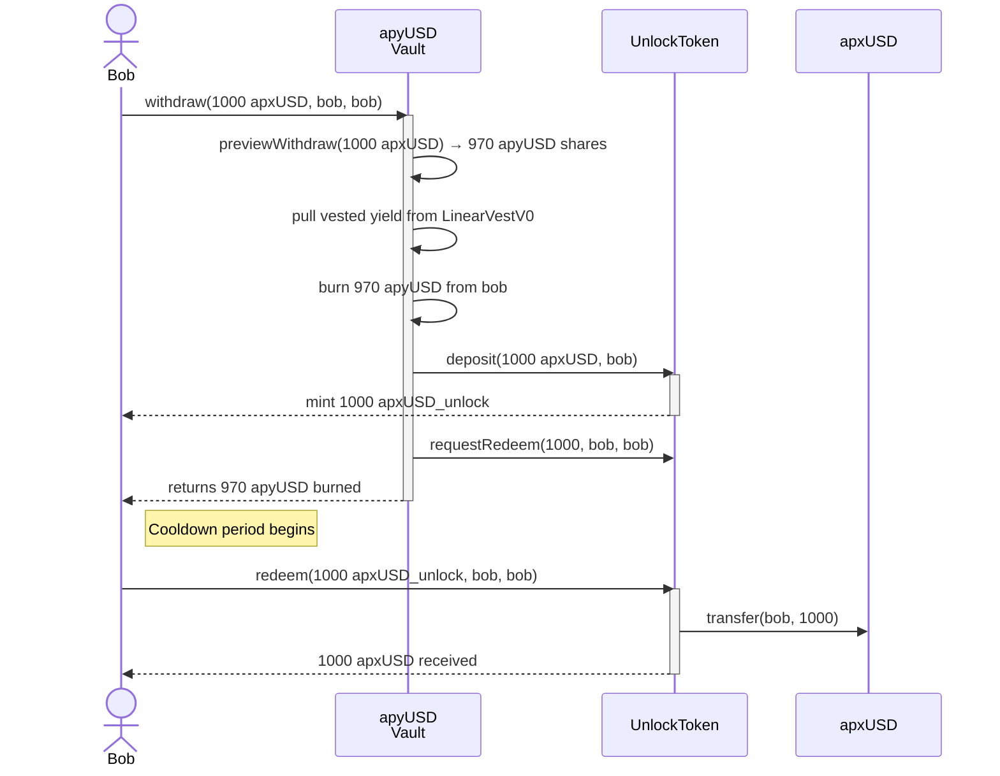
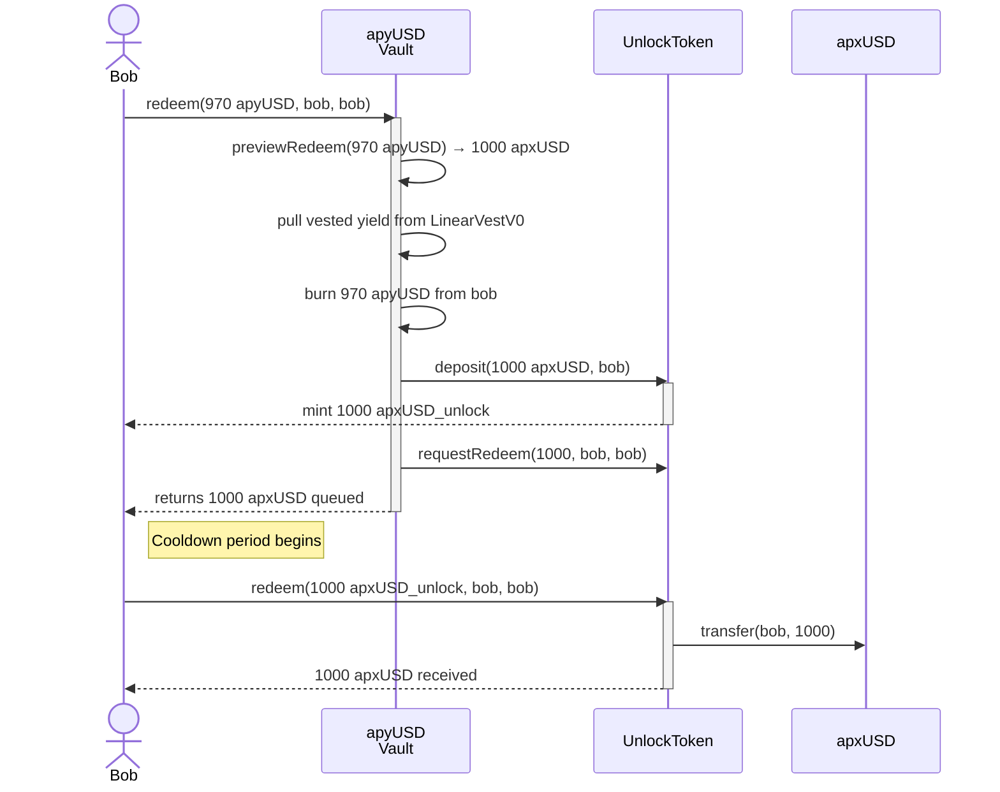
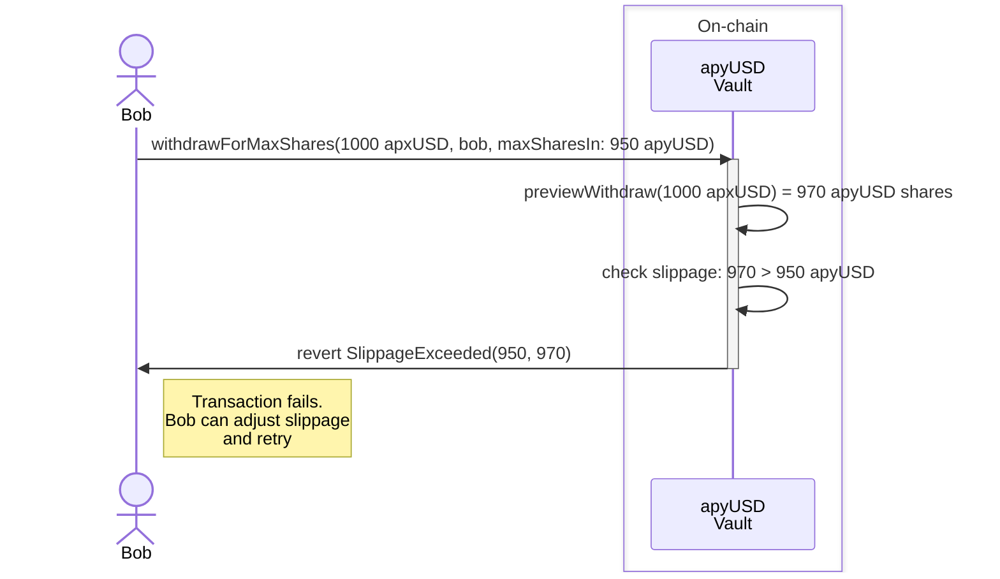

# How Apyx Works
_source: https://docs.apyx.fi/apyx-overview/how-apyx-works.md_

> For the complete documentation index, see [llms.txt](https://docs.apyx.fi/llms.txt). Markdown versions of documentation pages are available by appending `.md` to page URLs; this page is available as [Markdown](https://docs.apyx.fi/apyx-overview/how-apyx-works.md).

# How Apyx Works

<figure><figcaption></figcaption></figure>

The Apyx protocol has four core components:

* **Users:** Individuals who interact with the protocol by depositing USDC to acquire apxUSD and, optionally, locking apxUSD to receive apyUSD.
* **Offchain Treasury:** Allocates incoming USDC to acquire a diversified basket of low-volatility, dividend-bearing perpetual preferred shares or highly liquid cash-equivalents. It collects dividend payments and converts the proceeds into onchain distributable yield.
* **Onchain Vault:** Receives yield and distributes it to apyUSD holders over time by increasing apyUSD’s redemption value.
* **Stock Market:** The external market where the protocol acquires the preferred assets or other more liquid backing assets used in the collateral basket.

### Process Flow

#### Minting apxUSD

End users obtain and use apxUSD through secondary markets. Like many other stablecoin projects, whitelisted users deposit collateral and receive newly minted apxUSD.

Any spreads and offchain execution expenses incurred during minting and redemption may be reflected in the price. Apyx generates minimal profit from minting and redemption; costs are limited to what is necessary to operate the protocol and prevent various attacks.

All redemption activity occurs at Redemption Value. New issuance is priced at $1; redemptions track the underlying basket.

#### Collateral Acquisition

The Offchain Treasury allocates incoming capital to acquire a basket of preferred assets ("Prefs") and short-term treasury bonds. Initially, the basket includes STRC and SATA, with additional assets added over time.

Refer to [Collateral Allocation](/solution-overview/example-collateral-allocation.md) for details.

Acquired Prefs are held in custody in designated accounts, and the Offchain Treasury manages allocation and operations. Since the backing assets are held offchain, Apyx provides regular third-party accounting attestations and transparent reporting on custody and collateral composition so users can independently verify the backing.

Refer to [Custody Overview](/collateral-and-custody/custody-overview.md) for details. Real time visibility into capital deployment and the current reserve position is available in the dApp dashboard.

#### Protocol Rewards Distribution

Dividends from Prefs are collected offchain, converted into apxUSD, and sent to the Apyx Onchain Vault. The vault distributes this yield to apyUSD holders in a stream over a 20 day period.

Users can lock apxUSD in the vault to receive apyUSD. apyUSD represents a locked position that accrues the yield sent to the vault, increasing in redeemable value over time.

Refer to [apyUSD Yield Distribution](/solution-overview/apyusd-yield-distribution.md) for details.


The protocol is designed not to rehypothecate or lend deposited apxUSD. apyUSD yield is intended to be sourced from cashflows generated by Prefs.



---

# Agent Instructions
This documentation is published with GitBook. GitBook is the documentation platform designed so that both humans and AI agents can read, navigate, and reason over technical content effectively. Learn more at gitbook.com.

## Querying This Documentation
If you need additional information that is not directly available in this page, you can query the documentation dynamically by asking a question.

Perform an HTTP GET request on the current page URL with the `ask` query parameter, and the optional `goal` query parameter:

```
GET https://docs.apyx.fi/apyx-overview/how-apyx-works.md?ask=<question>&goal=<endgoal>
```

`ask` is the immediate question: it should be specific, self-contained, and written in natural language.
`goal` is optional and describes the broader end goal you are ultimately trying to accomplish on behalf of the user. GitBook uses it to tailor the answer towards what is most useful for that goal.

The response will contain a direct answer to the question and relevant excerpts and sources from the documentation.

Use this mechanism when the answer is not explicitly present in the current page, you need clarification or additional context, or you want to retrieve related documentation sections.


---

# apxUSD
_source: https://docs.apyx.fi/product-overview/apxusd-overview.md_

> For the complete documentation index, see [llms.txt](https://docs.apyx.fi/llms.txt). Markdown versions of documentation pages are available by appending `.md` to page URLs; this page is available as [Markdown](https://docs.apyx.fi/product-overview/apxusd-overview.md).

# apxUSD

apxUSD is Apyx’s synthetic dollar backed by a diversified basket of low-volatility, variable-rate, preferred shares issued by industry leading Digital Asset Treasuries (DATs).

The same mechanism that underpins apxUSD also enables apyUSD, a savings asset that accrues rewards from dividends generated by the DAT preferred equity backing apxUSD. apyUSD is designed as the first Digital Credit savings asset, bringing offchain dividend income onchain for programmatic distribution.

apxUSD is intended to be used as both collateral and a quote asset across DeFi and CeFi, with long-term demand driven by utility rather than short-term incentives.

### Collateral Allocation

The collateral backing apxUSD is dynamically allocated across preferred shares issued by various DATs.

The basket rebalances subject to issuer concentration, liquidity requirements for efficient execution, and coverage requirements that keep apxUSD overcollateralized. In redemption scenarios, the protocol liquidates preferred shares to USDC to settle redemption obligations; holders do not receive preferred shares directly.

[Learn more about the underlying collateral.](#collateral-allocation)

### Peg Stability Model

apxUSD maintains peg stability through four complementary mechanisms:

1. **Preferred Shares Price-Stabilization Dynamics**

   Preferred shares used as collateral often include structural features that allow issuers to adjust dividend rates, helping keep trading prices near par.
2. **Overcollateralized Issuance Framework**

   Redemptions occur at Redemption Value, which tracks the underlying basket. Total Collateral Value (the full reserve including the overcollateralization buffer) is published separately on the dashboard. The buffer grows through stress events rather than being drained by them
3. **Cross-Market Arbitrage**

   Apyx may engage in arbitrage across multiple spot markets involving apxUSD to support its peg. Similar opportunities are also available to users whitelisted, allowing them to mint or redeem apxUSD to capture price differences across markets.
4. **Derivative-Based Tail Hedging Strategies**\
   Apyx may deploy low cost, tail hedging strategies to reduce volatility in volatility spike scenarios where the preferred shares trade down significantly.

[Learn more about the Peg Stability Model.](#peg-stability-model)

### Minting and Redeeming

Eligible participants in permitted jurisdictions who are whitelisted, such as institutional market makers, may mint and redeem apxUSD through the protocol's designated issuance and redemption pathways. Redemptions are settled in USDC; the protocol does not transfer preferred shares directly to redeeming participants. In a drawdown scenario, the protocol would sell preferred share positions to USDC to facilitate redemption.

apxUSD grows through a demand-driven flywheel. When apxUSD trades at a premium relative to its backing, minters may mint additional apxUSD and purchase more preferred equity collateral. This expands the collateral base, deepens liquidity, and increases the dividend capacity that supports apyUSD.

General users can acquire apxUSD through permissionless external liquidity pools and swaps.

Eligible participants in permitted jurisdictions who are whitelisted Apyx, such as institutional partners and market makers, may mint and redeem apxUSD through the protocol's designated issuance and redemption pathways. Mint and redemption requests are processed quickly. To ensure stability, the protocol maintains a liquidity buffer sized against the largest historical TVL drawdowns observed in comparable stablecoins. Note that liquidity may be more limited outside of traditional trading hours and on weekends, though the buffer remains available at all times.

apxUSD is designed to trade between Redemption Value (a hard floor) and Total Collateral Value. Redemption Value moves with the underlying basket of preferred shares, dampened by the cash portion of the reserve. New apxUSD issuance is always priced at $1, giving the secondary market a consistent anchor.

Whitelisted participants can mint and redeem through the protocol's primary market at Redemption Value. There is also an RFQ (Request for Quote) redemption system that connects redemption requests with approved counterparties for competitive execution.


---

# Agent Instructions
This documentation is published with GitBook. GitBook is the documentation platform designed so that both humans and AI agents can read, navigate, and reason over technical content effectively. Learn more at gitbook.com.

## Querying This Documentation
If you need additional information that is not directly available in this page, you can query the documentation dynamically by asking a question.

Perform an HTTP GET request on the current page URL with the `ask` query parameter, and the optional `goal` query parameter:

```
GET https://docs.apyx.fi/product-overview/apxusd-overview.md?ask=<question>&goal=<endgoal>
```

`ask` is the immediate question: it should be specific, self-contained, and written in natural language.
`goal` is optional and describes the broader end goal you are ultimately trying to accomplish on behalf of the user. GitBook uses it to tailor the answer towards what is most useful for that goal.

The response will contain a direct answer to the question and relevant excerpts and sources from the documentation.

Use this mechanism when the answer is not explicitly present in the current page, you need clarification or additional context, or you want to retrieve related documentation sections.


---

# apyUSD
_source: https://docs.apyx.fi/product-overview/apyusd-overview.md_

> For the complete documentation index, see [llms.txt](https://docs.apyx.fi/llms.txt). Markdown versions of documentation pages are available by appending `.md` to page URLs; this page is available as [Markdown](https://docs.apyx.fi/product-overview/apyusd-overview.md).

# apyUSD

apyUSD is the savings token for apxUSD, built using the ERC-4626 vault standard.

Users deposit apxUSD into a permissionless vault and receive apyUSD in return. Token balances do not rebase. Instead, yield accrues through a gradually increasing exchange rate, meaning each apyUSD can be redeemed for more apxUSD over time.

Yield is generated from the protocol’s underlying collateral stack.

### Key Information

* Underlying: apxUSD
* Standard: ERC-4626 vault (non-rebasing, accrual-based)
* Access: Permissionless; no KYB/KYC requirement
* Yield source: Dividends
* Distribution: Governed via on-chain parameters; rate may vary with market conditions
* Redemption: 1 apyUSD → apxUSD × exchangeRate (t ≥ 1)


Participation is restricted for users in certain jurisdictions. Users located in such jurisdictions will be prevented from accessing the Apyx frontend.


### Redemption

Redemptions follow an asynchronous unlocking model (ERC-7540) and are not executed immediately.

The process consists of three steps: **request**, **cooldown (approximately 20 days)**, and **claim**. Once a redemption request is submitted, a cooldown period begins during which the assets remain locked. After the cooldown period has elapsed, the user must submit a claim transaction to receive the redeemed assets.

Each user may have only one pending redemption request at a time. Adding assets to an existing request resets the cooldown period from the time of the update.

During the cooldown period, users will not receive yield on their apyUSD, with the apxUSD/apyUSD exchange rate being fixed.

### Flexible Redemption

apyUSD redemptions support a more flexible redemption mechanism designed to improve liquidity and user optionality. When initiating a new redemption, users receive an onchain Unlock Receipt NFT representing their pending claim. Redemptions become claimable after 3 days, with an early redemption fee that declines linearly over time from 3.5% down to just 0.1%.

This mechanism allows users to:

* Exit faster when liquidity is needed
* Queue multiple unlock requests simultaneously
* Reduce fees by waiting longer before claiming

Looking ahead, redemption windows are expected to compress further as underlying digital credit instruments transition toward more frequent distributions.


---

# Agent Instructions
This documentation is published with GitBook. GitBook is the documentation platform designed so that both humans and AI agents can read, navigate, and reason over technical content effectively. Learn more at gitbook.com.

## Querying This Documentation
If you need additional information that is not directly available in this page, you can query the documentation dynamically by asking a question.

Perform an HTTP GET request on the current page URL with the `ask` query parameter, and the optional `goal` query parameter:

```
GET https://docs.apyx.fi/product-overview/apyusd-overview.md?ask=<question>&goal=<endgoal>
```

`ask` is the immediate question: it should be specific, self-contained, and written in natural language.
`goal` is optional and describes the broader end goal you are ultimately trying to accomplish on behalf of the user. GitBook uses it to tailor the answer towards what is most useful for that goal.

The response will contain a direct answer to the question and relevant excerpts and sources from the documentation.

Use this mechanism when the answer is not explicitly present in the current page, you need clarification or additional context, or you want to retrieve related documentation sections.


---

# Peg Stability Model
_source: https://docs.apyx.fi/solution-overview/peg-stability-model.md_

> For the complete documentation index, see [llms.txt](https://docs.apyx.fi/llms.txt). Markdown versions of documentation pages are available by appending `.md` to page URLs; this page is available as [Markdown](https://docs.apyx.fi/solution-overview/peg-stability-model.md).

# Peg Stability Model

Apyx maintains apxUSD’s peg stability through a combination of (1) the price stabilization characteristics of the preferreds as collateral, (2) an overcollateralized issuance framework for apxUSD itself, (3) cash & treasuries buffer within the capital basket (4) cross-market arbitrage incentives in secondary markets.

### Price Stabilization Mechanism of STRC as Collateral

At the current stage, apxUSD primarily uses STRC as its core collateral asset. STRC is Strategy’s variable rate, non-convertible perpetual preferred equity, structured around a $100 stated amount per share, with dividends determined and paid on a monthly basis.

Importantly, STRC is not a legally fixed peg instrument. Instead, it is designed with an embedded economic mechanism intended to encourage trading near its reference value. Strategy retains discretion to review and adjust the dividend rate each month with the stated objective of keeping STRC trading around its $100 par or stated value and reducing price volatility.

The intuition behind this mechanism is straightforward:

* When STRC trades at a discount to its reference value, an upward adjustment to the dividend rate can raise yield relative to price, supporting demand and improving price recovery.
* When STRC trades at a premium, a downward adjustment can reduce excess yield incentives and help moderate price deviations.

Rather than enforcing a hard peg, STRC relies on dividend policy as a market-based lever to guide trading behavior toward a reference price range. apxUSD is designed on top of this collateral profile and explicitly accounts for STRC’s stabilization characteristics.

### Overcollateralized Issuance Framework of apxUSD

While STRC provides a degree of inherent price stabilization, apyx adds an explicit overcollateralization layer. The total apxUSD minted is constrained by the market value of the collateral, ensuring collateral value exceeds outstanding liabilities by a defined margin.

Importantly, the overcollateralization buffer is **not** consumed during routine redemptions. All mint and redeem activity occurs at **Redemption Value**, which tracks the underlying basket of preferred shares and cash. The buffer—the gap between Redemption Value and **Total Collateral Value**—is preserved through stress events and grows over time via yield spreads and collateral appreciation.

### Cash & Treasuries Buffer

Potentially the strongest volatility hedge is the cash and treasuries buffer. With the preferreds generating strong yield, a portion of the collateral can be held in treasuries to reduce volatility, without meaningfully reducing the overall yield of the collateral base.

### Cross-Market Arbitrage

While the overcollateralization framework governs the soundness of apxUSD issuance and redemption, deviations from the one-dollar reference price in secondary markets are addressed through arbitrage incentives executed by eligible whitelist participants.

* **When apxUSD Trades Above $1.00 (Premium):**\
  Eligible participants may use the protocol’s minting pathway to mint apxUSD under predefined terms and sell it into external markets where apxUSD is trading at a premium. This increases circulating supply and applies downward pressure on the market price, encouraging convergence toward the reference level.
* **When apxUSD Trades Below $1.00 (Discount):**

  Eligible participants may acquire apxUSD at a discount in secondary markets and redeem it through the protocol for dollar-equivalent value. This reduces circulating supply while increasing buy-side demand, supporting price recovery toward the reference level.

These arbitrage dynamics align trading incentives with peg stability, helping apxUSD trade near its reference value across a range of venues.


---

# Agent Instructions
This documentation is published with GitBook. GitBook is the documentation platform designed so that both humans and AI agents can read, navigate, and reason over technical content effectively. Learn more at gitbook.com.

## Querying This Documentation
If you need additional information that is not directly available in this page, you can query the documentation dynamically by asking a question.

Perform an HTTP GET request on the current page URL with the `ask` query parameter, and the optional `goal` query parameter:

```
GET https://docs.apyx.fi/solution-overview/peg-stability-model.md?ask=<question>&goal=<endgoal>
```

`ask` is the immediate question: it should be specific, self-contained, and written in natural language.
`goal` is optional and describes the broader end goal you are ultimately trying to accomplish on behalf of the user. GitBook uses it to tailor the answer towards what is most useful for that goal.

The response will contain a direct answer to the question and relevant excerpts and sources from the documentation.

Use this mechanism when the answer is not explicitly present in the current page, you need clarification or additional context, or you want to retrieve related documentation sections.


---

# Yield Distribution
_source: https://docs.apyx.fi/solution-overview/apyusd-yield-distribution.md_

> For the complete documentation index, see [llms.txt](https://docs.apyx.fi/llms.txt). Markdown versions of documentation pages are available by appending `.md` to page URLs; this page is available as [Markdown](https://docs.apyx.fi/solution-overview/apyusd-yield-distribution.md).

# Yield Distribution

### Protocol Revenue Explanation

apyUSD yield is sourced from semi-stable preferred shares held offchain in custody. For example, STRC pays dividends at an annualized rate of 11% and SATA at an initial rate of 12.5%, with dividends paid monthly in cash. These proceeds are converted into apxUSD and credited to the apyUSD vault via the `YieldDistributor`.


The protocol does not rehypothecate, lend, or otherwise utilize deposited apxUSD for any purpose.


### Distribution Mechanism

Yield credited to the apyUSD vault utilizes a linear vesting mechanism implemented by the `LinearVestV0` contract. Instead of a single lump-sum distribution, yield is streamed continuously over a configurable period (e.g., 20 days).

Each month, the yield rate is set for the following month, based on the yield generated by the collateral base the prior month. The yield rate is set in dollar terms, e.g. $1M of yield will be paid this month. That yield is paid across all apyUSD not currently undergoing cooldown, meaning new apyUSD that is locked instantly begins receiving yield, reducing the overall % yield for everyone else. On the flip side, any apyUSD that enters the cooldown phase is removed from the pool set to receive yield, meaning the remaining apyUSD receive a higher % yield.

This structure supports protocol stability (potentially at the expense of growth), by creating a slower expansion and contraction curve.


---

# Agent Instructions
This documentation is published with GitBook. GitBook is the documentation platform designed so that both humans and AI agents can read, navigate, and reason over technical content effectively. Learn more at gitbook.com.

## Querying This Documentation
If you need additional information that is not directly available in this page, you can query the documentation dynamically by asking a question.

Perform an HTTP GET request on the current page URL with the `ask` query parameter, and the optional `goal` query parameter:

```
GET https://docs.apyx.fi/solution-overview/apyusd-yield-distribution.md?ask=<question>&goal=<endgoal>
```

`ask` is the immediate question: it should be specific, self-contained, and written in natural language.
`goal` is optional and describes the broader end goal you are ultimately trying to accomplish on behalf of the user. GitBook uses it to tailor the answer towards what is most useful for that goal.

The response will contain a direct answer to the question and relevant excerpts and sources from the documentation.

Use this mechanism when the answer is not explicitly present in the current page, you need clarification or additional context, or you want to retrieve related documentation sections.


---

# Capitalization Framework
_source: https://docs.apyx.fi/solution-overview/capitalization-framework.md_

> For the complete documentation index, see [llms.txt](https://docs.apyx.fi/llms.txt). Markdown versions of documentation pages are available by appending `.md` to page URLs; this page is available as [Markdown](https://docs.apyx.fi/solution-overview/capitalization-framework.md).

# Capitalization Framework

Apyx publishes two distinct metrics on the transparency dashboard that govern every interaction with the protocol.

#### Redemption Value <a href="#redemption-value" id="redemption-value"></a>

The price at which all redemption occurs, with a small spread for liquidity and slippage. Redemption Value tracks the underlying basket of preferred shares and cash, dampened by the cash portion of the reserve. It applies identically across calm and stressed conditions, and to all participants.

New apxUSD issuance is always priced at $1, providing a consistent anchor for secondary markets.

#### Total Collateral Value <a href="#total-collateral-value" id="total-collateral-value"></a>

The full value of the reserve, including the overcollateralization buffer.

The gap between Redemption Value and Total Collateral Value is the buffer, visible to everyone at all times.

#### How apxUSD Trades <a href="#how-apxusd-trades" id="how-apxusd-trades"></a>

In practice, apxUSD trades between Redemption Value and Total Collateral Value:

* Redemption Value acts as a hard floor where arbitrageurs step in.
* The overcollateralized reserve supports pricing above it.

#### Role of the Overcollateralization Buffer <a href="#role-of-the-overcollateralization-buffer" id="role-of-the-overcollateralization-buffer"></a>

The overcollateralization buffer is not consumed during routine redemptions. It serves two purposes:

1. **Risk reduction without sacrificing yield.** The buffer is allocated to preferred equity, with the yield it generates flowing to the rest of the portfolio. As the buffer grows, the remainder of the collateral can shift toward cash while maintaining the same yield output—reducing volatility without compromising returns to apyUSD holders.
2. **Final backstop.** In a catastrophic scenario—a devastating hack, wind-down, or any event ending the protocol's future viability—Total Collateral Value becomes the redemption value, and the entire reserve, buffer included, is distributed pro-rata to remaining holders.

Governance token holders may also vote to deploy a portion of the overcollateralization buffer in intermediate-risk scenarios to support Redemption Value.

#### RFQ Redemption <a href="#rfq-redemption" id="rfq-redemption"></a>

In addition to the protocol's primary-market redemption pathway, Apyx offers a Request for Quote (RFQ) redemption system. Users may submit redemption requests through a structured RFQ process, allowing approved counterparties to provide competitive execution against the underlying reserve.


---

# Agent Instructions
This documentation is published with GitBook. GitBook is the documentation platform designed so that both humans and AI agents can read, navigate, and reason over technical content effectively. Learn more at gitbook.com.

## Querying This Documentation
If you need additional information that is not directly available in this page, you can query the documentation dynamically by asking a question.

Perform an HTTP GET request on the current page URL with the `ask` query parameter, and the optional `goal` query parameter:

```
GET https://docs.apyx.fi/solution-overview/capitalization-framework.md?ask=<question>&goal=<endgoal>
```

`ask` is the immediate question: it should be specific, self-contained, and written in natural language.
`goal` is optional and describes the broader end goal you are ultimately trying to accomplish on behalf of the user. GitBook uses it to tailor the answer towards what is most useful for that goal.

The response will contain a direct answer to the question and relevant excerpts and sources from the documentation.

Use this mechanism when the answer is not explicitly present in the current page, you need clarification or additional context, or you want to retrieve related documentation sections.


---

# Overview
_source: https://docs.apyx.fi/technical-overview/protocol-contracts-overview.md_

> For the complete documentation index, see [llms.txt](https://docs.apyx.fi/llms.txt). Markdown versions of documentation pages are available by appending `.md` to page URLs; this page is available as [Markdown](https://docs.apyx.fi/technical-overview/protocol-contracts-overview.md).

# Overview

<table data-view="cards"><thead><tr><th></th><th data-hidden data-card-cover data-type="image">Cover image</th><th data-hidden data-card-target data-type="content-ref"></th></tr></thead><tbody><tr><td>Locking</td><td><a href="/files/YmKq45gY07ABbXh9MOUF">/files/YmKq45gY07ABbXh9MOUF</a></td><td><a href="/pages/T2yZPYrcdWopGhoUsRYP">/pages/T2yZPYrcdWopGhoUsRYP</a></td></tr><tr><td>Unlocking</td><td><a href="/files/QARmzEqTbJ0zpnpDPfiW">/files/QARmzEqTbJ0zpnpDPfiW</a></td><td><a href="/pages/5P8sJ5Co3lN2IGODVAtV">/pages/5P8sJ5Co3lN2IGODVAtV</a></td></tr><tr><td>Glossary</td><td><a href="/files/xA7WrCHEldP7A586qD6f">/files/xA7WrCHEldP7A586qD6f</a></td><td><a href="/pages/k7YRiELQGSCJitYrd3Ls">/pages/k7YRiELQGSCJitYrd3Ls</a></td></tr></tbody></table>

## Contract Addresses

| Contract                 | Address                                                                                                                   |
| ------------------------ | ------------------------------------------------------------------------------------------------------------------------- |
| apxUSD                   | [`0x98A878b1Cd98131B271883B390f68D2c90674665`](https://etherscan.io/address/0x98A878b1Cd98131B271883B390f68D2c90674665)   |
| apyUSD                   | [`0x38EEb52F0771140d10c4E9A9a72349A329Fe8a6A`](https://etherscan.io/address/0x38EEb52F0771140d10c4E9A9a72349A329Fe8a6A)\` |
| UnlockToken              | [`0x93775E2dFa4e716c361A1f53F212c7AE031BF4e6`](https://etherscan.io/address/0x93775E2dFa4e716c361A1f53F212c7AE031BF4e6)\` |
| ApyUSDRateView           | [`0xCABa36EDE2C08e16F3602e8688a8bE94c1B4e484`](https://etherscan.io/address/0xCABa36EDE2C08e16F3602e8688a8bE94c1B4e484)\` |
| CommitToken: apxUSD      | [`0x17122d869d981d184118B301313BCD157c79871e`](https://etherscan.io/address/0x17122d869d981d184118B301313BCD157c79871e)\` |
| Curve: apxUSD-USDC       | [`0xE1B96555BbecA40E583BbB41a11C68Ca4706A414`](https://etherscan.io/address/0xE1B96555BbecA40E583BbB41a11C68Ca4706A414)\` |
| CommitToken: apxUSD-USDC | [`0xdfC3cF7E540628a52862907DC1AB935Cd5859375`](https://etherscan.io/address/0xdfC3cF7E540628a52862907DC1AB935Cd5859375)\` |


---

# Agent Instructions
This documentation is published with GitBook. GitBook is the documentation platform designed so that both humans and AI agents can read, navigate, and reason over technical content effectively. Learn more at gitbook.com.

## Querying This Documentation
If you need additional information that is not directly available in this page, you can query the documentation dynamically by asking a question.

Perform an HTTP GET request on the current page URL with the `ask` query parameter, and the optional `goal` query parameter:

```
GET https://docs.apyx.fi/technical-overview/protocol-contracts-overview.md?ask=<question>&goal=<endgoal>
```

`ask` is the immediate question: it should be specific, self-contained, and written in natural language.
`goal` is optional and describes the broader end goal you are ultimately trying to accomplish on behalf of the user. GitBook uses it to tailor the answer towards what is most useful for that goal.

The response will contain a direct answer to the question and relevant excerpts and sources from the documentation.

Use this mechanism when the answer is not explicitly present in the current page, you need clarification or additional context, or you want to retrieve related documentation sections.


---

# Locking apxUSD for apyUSD
_source: https://docs.apyx.fi/technical-overview/locking.md_

> For the complete documentation index, see [llms.txt](https://docs.apyx.fi/llms.txt). Markdown versions of documentation pages are available by appending `.md` to page URLs; this page is available as [Markdown](https://docs.apyx.fi/technical-overview/locking.md).

# Locking apxUSD for apyUSD

apxUSD holders can lock their tokens to receive apyUSD tokens, which accrue yield from the preferred share dividend payments distributed to the apyUSD vault. Locking is synchronous and immediate, providing instant access to yield.

apyUSD is an ERC-4626 compliant tokenized vault with synchronous deposits. Withdrawals are handled synchronously but return apxUSD\_unlock, which is non-transferrable and can be redeemed for apxUSD after a cooldown period. This makes unlocking effectively asynchronous.

### Understanding Lock Methods

The vault provides standard ERC-4626 methods for locking, offering flexibility in how users specify amounts:

**For Locking (Deposits - Synchronous):**

* **`deposit(assets, receiver)`**: Specify exact apxUSD amount to deposit, receive calculated apyUSD shares immediately
  * Use when: You know exactly how much apxUSD you want to lock
  * Example: "I want to lock 1000 apxUSD"
* **`mint(shares, receiver)`**: Specify exact apyUSD shares to receive, deposit calculated apxUSD amount immediately
  * Use when: You know exactly how many apyUSD shares you want
  * Example: "I want to mint 950 apyUSD shares"


Prefer to use the `depositForMinShares` and `mintForMaxAssets` methods to limit price risk when locking apxUSD.


### Price Controls on Locking

The apyUSD also exposes deposit and mint methods with price controls to limit price risk between submitting a transaction and the transaction being included in a block:

* **`depositForMinShares(uint256 assets, uint256 minShares, address receiver)`**: Deposits exact assets for shares or reverts if less than min shares will be minted
* **`mintForMaxAssets(uint256 shares, uint256 maxAssets, address receiver)`**: Mint exact shares for assets or reverts if more than max assets will be deposited

### Total Assets and Vested Yield

The apyUSD vault's `totalAssets()` function includes both:

* The vault's apxUSD balance (assets held directly in the vault)
* The `vestedAmount()` available in the LinearVestV0 contract

This means that the exchange rate calculation for deposits accounts for vested yield that hasn't yet been transferred to the vault. Yield from minting operations is deposited into the YieldDistributor and then into the LinearVestV0 contract, where it vests linearly over a time. The apyUSD vault considers this vested yield as part of its total assets, ensuring that users receive shares that reflect the full value of the vault, including yield that is vesting.

When a withdrawal is requested, the vault automatically pulls all vested yield from the LinearVestV0 contract before processing the withdrawal, ensuring it has sufficient assets to fund the withdrawal.

#### Deposit Examples

1. Alice calls `apyUSD.deposit(1000e18, alice)`
2. apyUSD calculates shares based on `totalAssets()` which includes vested yield
3. apyUSD determine the exchange rate between assets and shares
4. apxUSD is transferred from Alice to apyUSD vault
5. apyUSD shares are minted to Alice immediately (no cooldown)

### Protections & Controls

The following controls protect the locking system:

#### Pause Controls:

* **Global Pause**: The apyUSD vault can be paused, preventing all token transfers including deposits and mints
* **Purpose**: Emergency stop mechanism to halt all vault operations in case of security issues or critical bugs

#### Deny List Controls:

* **Address Blocking**: AddressList contract checks addresses at execution time
* **Blocks**: Deposits and mints
* **No Cancellation**: Denylisted addresses are rejected immediately (revert), not cancelled after the fact

Protections are implemented in the apyUSD vault contract and the AddressList deny list contract:

Methods have been omitted for brevity, but apxUSD will implement the full [ERC-20](https://ethereum.org/developers/docs/standards/tokens/erc-20/) interface. The apyUSD contract will be upgradeable using the UUPS pattern, allowing for future improvements while maintaining security through AccessManager-based governance.

### Success & Failure Flows

#### Deposit Success

Users specify the exact amount of apxUSD to deposit and receive calculated apyUSD shares immediately.



#### Mint Success

Users specify the exact amount of apyUSD shares to receive and deposit the calculated apxUSD amount immediately.



#### Deposit Failure - Slippage Exceeded

When the slippage is exceeded on deposit or mint.



#### Deposit Failure - Deny Listed

When the caller or receiver is on the deny list, the deposit operation reverts immediately.




---

# Agent Instructions
This documentation is published with GitBook. GitBook is the documentation platform designed so that both humans and AI agents can read, navigate, and reason over technical content effectively. Learn more at gitbook.com.

## Querying This Documentation
If you need additional information that is not directly available in this page, you can query the documentation dynamically by asking a question.

Perform an HTTP GET request on the current page URL with the `ask` query parameter, and the optional `goal` query parameter:

```
GET https://docs.apyx.fi/technical-overview/locking.md?ask=<question>&goal=<endgoal>
```

`ask` is the immediate question: it should be specific, self-contained, and written in natural language.
`goal` is optional and describes the broader end goal you are ultimately trying to accomplish on behalf of the user. GitBook uses it to tailor the answer towards what is most useful for that goal.

The response will contain a direct answer to the question and relevant excerpts and sources from the documentation.

Use this mechanism when the answer is not explicitly present in the current page, you need clarification or additional context, or you want to retrieve related documentation sections.


---

# Unlocking apyUSD for apxUSD
_source: https://docs.apyx.fi/technical-overview/unlocking.md_

> For the complete documentation index, see [llms.txt](https://docs.apyx.fi/llms.txt). Markdown versions of documentation pages are available by appending `.md` to page URLs; this page is available as [Markdown](https://docs.apyx.fi/technical-overview/unlocking.md).

# Unlocking apyUSD for apxUSD

apyUSD holders can unlock their tokens to receive apxUSD assets. apyUSD is a synchronous ERC-4626 vault — withdrawals and redeems execute immediately and return **apxUSD\_unlock** tokens. apxUSD\_unlock is redeemable 1:1 for apxUSD after a 20 day cooldown period but does not earn yield and is non-transferrable.

### Flexible Unlocks

apyUSD unlocks support a more flexible redemption mechanism designed to improve liquidity and user optionality. When initiating a new unlock, users receive an onchain Unlock Receipt NFT representing their pending claim. Unlocks become claimable after 3 days, with an early unlock fee that declines linearly over time from 3.5% down to just 0.1%.

This mechanism allows users to:

* Exit faster when liquidity is needed
* Queue multiple unlock requests simultaneously
* Reduce fees by waiting longer before claiming

Looking ahead, unlock windows are expected to compress further as underlying digital credit instruments transition toward more frequent distributions.


You cannot cancel unlocking once it has been initiated and will only be able to convert apxUSD\_unlock to apxUSD after the cooldown period.


### Understanding Unlock Methods

The vault provides standard ERC-4626 methods for unlocking, offering flexibility in how users specify amounts:

**For Unlocking (Synchronous — returns apxUSD\_unlock):**

* **`withdraw(assets, receiver, owner)`**: Specify the exact apxUSD amount to receive after cooldown; burn calculated apyUSD shares immediately
  * Use when: You know exactly how much apxUSD you want to unlock
  * Example: "I want to unlock 1000 apxUSD"
* **`redeem(shares, receiver, owner)`**: Specify the exact apyUSD shares to burn; receive calculated apxUSD\_unlock immediately
  * Use when: You know exactly how many apyUSD shares you want to exit
  * Example: "I want to redeem all 950 of my apyUSD shares"

After receiving apxUSD\_unlock tokens, call `UnlockToken.redeem()` once the cooldown period has elapsed to receive apxUSD.


Prefer to use the `withdrawForMaxShares` and `redeemForMinAssets` methods to limit price risk when unlocking apyUSD.



Multiple unlocks reset the cooldown period. For example, if you unlock 100 apxUSD you will receive apxUSD\_unlock that is convertable to apxUSD after the cooldown period. If you later unlock another 50 apxUSD the cooldown period will reset and you will have to wait the full period to completely unlock the 150 apxUSD.


### Price Controls on Unlocking

The apyUSD vault exposes withdraw and redeem methods with price controls to limit price risk between submitting a transaction and the transaction being included in a block:

* **`withdrawForMaxShares(uint256 assets, uint256 maxShares, address receiver)`**: Withdraws exact assets or reverts if more than max shares will be burned
* **`redeemForMinAssets(uint256 shares, uint256 minAssets, address receiver)`**: Redeems exact shares or reverts if less than min assets will be received

### Total Assets and Vested Yield

The apyUSD vault's `totalAssets()` function includes both:

* The vault's apxUSD balance (assets held directly in the vault)
* The `vestedAmount()` available in the LinearVestV0 contract

When a withdrawal is requested, the vault automatically pulls all vested yield from the vesting contract before processing the withdrawal, ensuring the exchange rate reflects the full accrued value and the vault has sufficient assets to fund the withdrawal.

#### Unlock Examples

1. Bob calls `apyUSD.withdraw(1000e18, bob, bob)`
2. apyUSD calculates shares based on `totalAssets()` which includes vested yield
3. apyUSD determines the exchange rate between assets and shares
4. Bob's apyUSD shares are burned immediately
5. 1000 apxUSD is deposited into the UnlockToken contract; Bob receives 1000 apxUSD\_unlock
6. After the cooldown period, Bob calls `UnlockToken.redeem(1000e18, bob, bob)` to receive 1000 apxUSD

### The UnlockToken: Tokenized Escrow During Cooldown

During the cooldown period, unlocked apxUSD assets are held in the **UnlockToken** contract.

**How it works:**

* User calls `apyUSD.withdraw()` or `apyUSD.redeem()` — apyUSD shares are burned synchronously
* The apxUSD assets are deposited into the UnlockToken contract by the vault
* The user immediately receives apxUSD\_unlock tokens (UnlockToken shares), redeemable 1:1 for apxUSD after the cooldown period
* The apyUSD vault is configured as the operator for UnlockToken, allowing it to initiate the redeem request on behalf of the user immediately
* After the cooldown period, the user calls `UnlockToken.redeem()` to receive their apxUSD


There is only one instance of UnlockToken and it is used exclusively by the apyUSD vault.


### Success & Failure Flows

#### Withdraw Success

Users specify the exact amount of apxUSD to receive after the cooldown period. apyUSD shares are burned immediately and apxUSD\_unlock tokens are returned.



#### Redeem Success

Users specify the exact amount of apyUSD shares to burn. The calculated apxUSD amount is deposited into UnlockToken and redeemable after the cooldown period.



#### Withdrawal Failure — Slippage Exceeded

When the slippage is exceeded on withdraw or redeem.




---

# Agent Instructions
This documentation is published with GitBook. GitBook is the documentation platform designed so that both humans and AI agents can read, navigate, and reason over technical content effectively. Learn more at gitbook.com.

## Querying This Documentation
If you need additional information that is not directly available in this page, you can query the documentation dynamically by asking a question.

Perform an HTTP GET request on the current page URL with the `ask` query parameter, and the optional `goal` query parameter:

```
GET https://docs.apyx.fi/technical-overview/unlocking.md?ask=<question>&goal=<endgoal>
```

`ask` is the immediate question: it should be specific, self-contained, and written in natural language.
`goal` is optional and describes the broader end goal you are ultimately trying to accomplish on behalf of the user. GitBook uses it to tailor the answer towards what is most useful for that goal.

The response will contain a direct answer to the question and relevant excerpts and sources from the documentation.

Use this mechanism when the answer is not explicitly present in the current page, you need clarification or additional context, or you want to retrieve related documentation sections.
